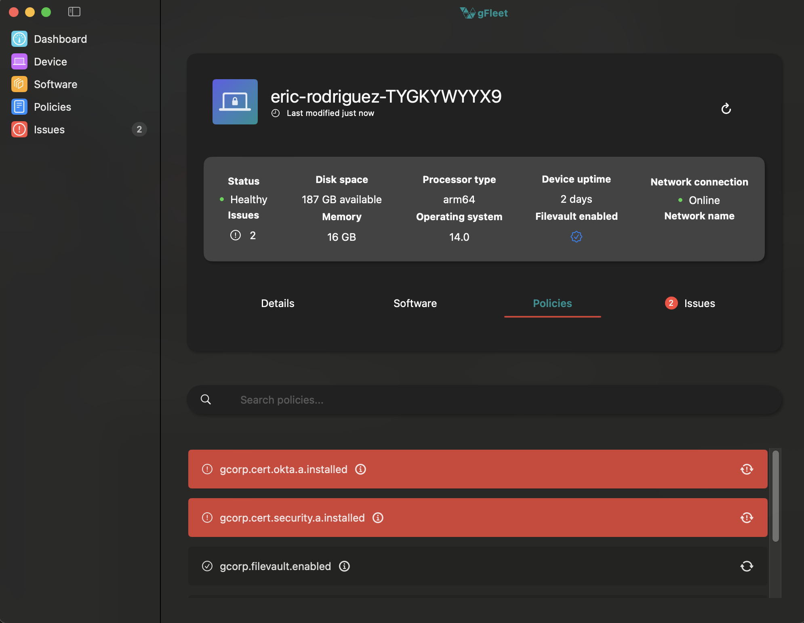
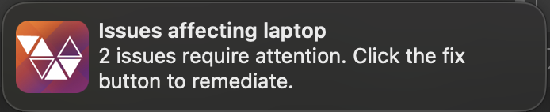
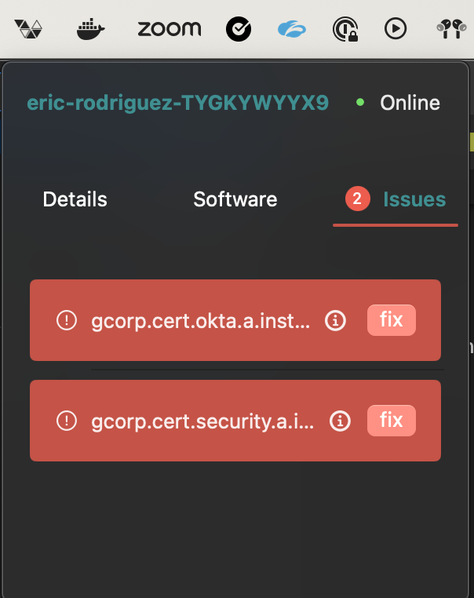

# gFleet
<p align="center">
    
</p>
<h2 align="center">An end user facing, SwiftUI based device health app.</h2>
<p align="center">
    <a href="https://github.com/eddique/gfleet/releases/latest"></a>
    <a href="https://www.linkedin.com/in/eric-rodriguez-3a402811b/"></a>
</p>

# Features
<p align="center">
    
</p>

- Custom plist or json configuration allowing to set compliant value and query
- Auto remediations with sudo commands
- Sleek UI with pertinent device information and fixes
- Menu bar icon
- Notifications when a device is out of compliance

# Custom configurations

gFleet will first look for gfleet-config.json in the root, then look for gfleet-config.plist if not found. Set your policies in the policy key.

ex gfleet-config.json
```json
{
    "organization": "My Org",
    "policies": [
        {
            "id": "1",
            "title": "My policy",
            "description": "This is my policy",
            "query": "SELECT 1 FROM disk_encryption WHERE user_uuid IS NOT '' AND filevault_status = 'on' LIMIT 1",
            "remediationType": "automatic",
            "compliantValue": "1"
        }
    ]
}
```

ex gfleet-config.plist
```plist
<?xml version="1.0" encoding="UTF-8"?>
<!DOCTYPE plist PUBLIC "-//Apple//DTD PLIST 1.0//EN" "http://www.apple.com/DTDs/PropertyList-1.0.dtd">
<plist version="1.0">
<dict>
    <key>organization</key>
    <string>Gusto</string>
    <key>policies</key>
    <array>
        <dict>
            <key>id</key>
            <string>1</string>
            <key>title</key>
            <string>gcorp.filevault.enabled</string>
            <key>description</key>
            <string>This is a test policy</string>
            <key>query</key>
            <string>SELECT 1 FROM disk_encryption WHERE user_uuid IS NOT "" AND filevault_status = 'on' LIMIT 1</string>
            <key>remediationType</key>
            <string>automatic</string>
            <key>remediation</key>
            <string>automatic</string>
            <key>compliantValue</key>
            <string>1</string>
        </dict>
    </array>
</dict>
</plist>
```

# UI

## Notifications

Notifications for policies that are currently out of compliance

<p align="center">
    
</p>

## Software

A detailed view of the software installed on the device

<p align="center">
    
</p>

## Policies

A detailed view of the device policies

<p align="center">
    
</p>

## Menu Bar Item

Manage actions from the device menu bar

<p align="center">
    
</p>